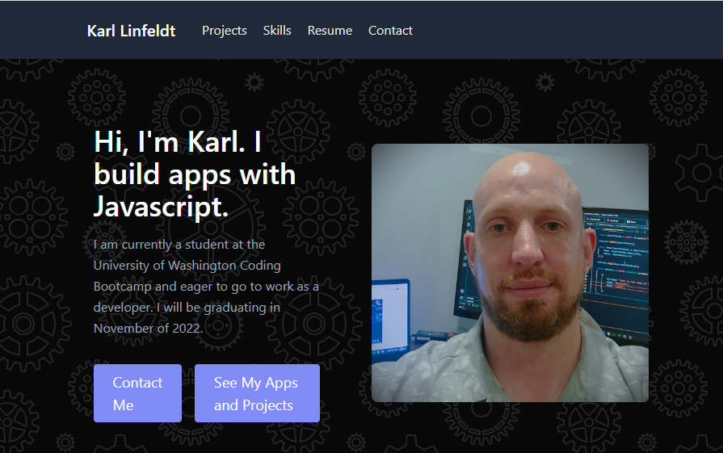
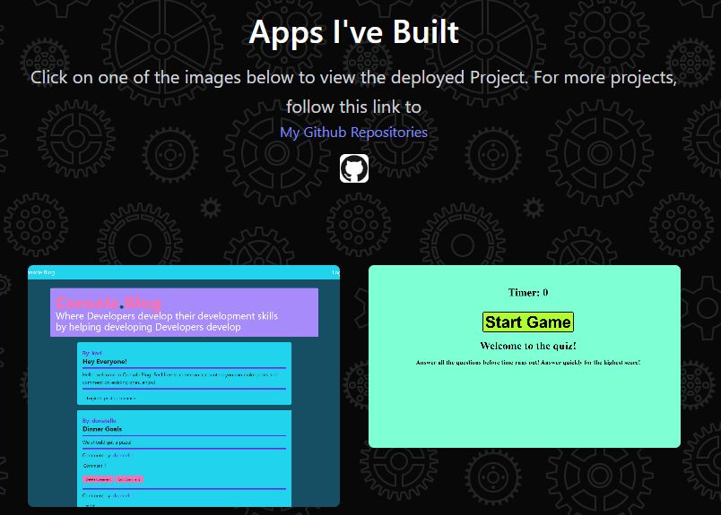
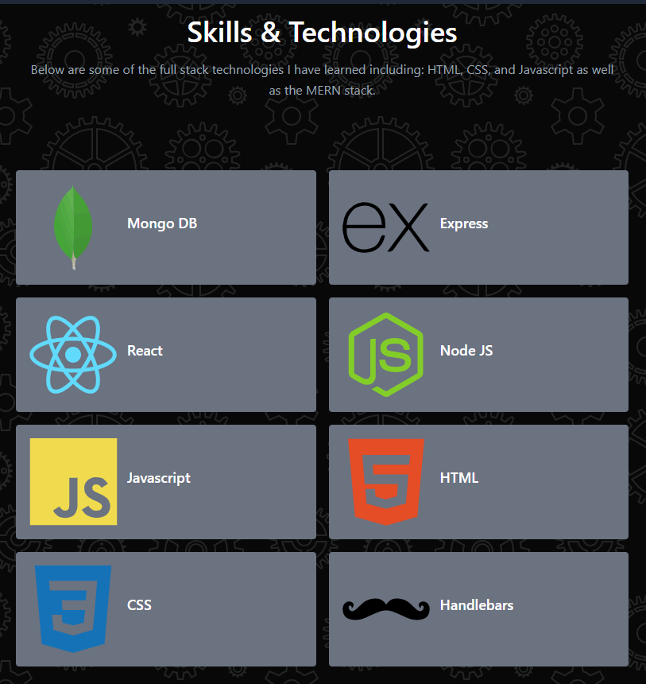
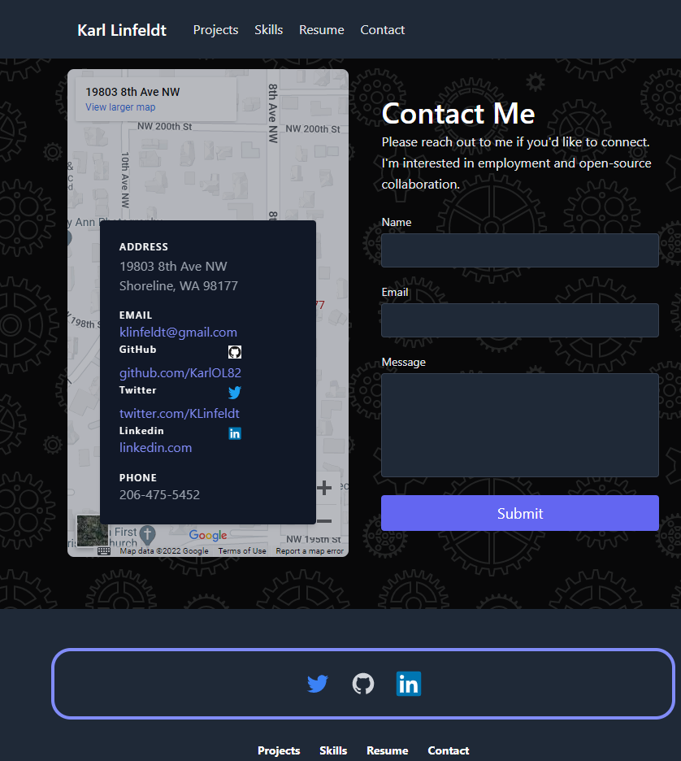
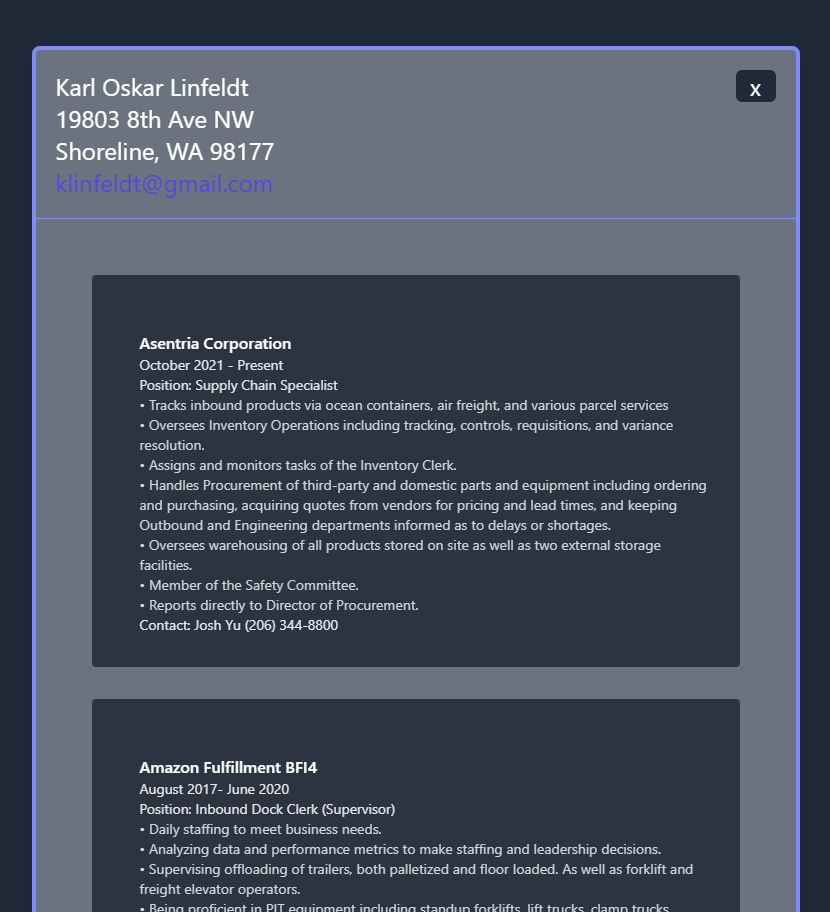

# Karl Linfeldt Portfolio Website
This is my live portfolio built with React and Tailwind CSS  

## Developer Info  
- Developed by Karl Linfeldt 
- [Live Page Deployment](https://karlol82.github.io/react-portfolio/)
- [Github Repo](https://github.com/KarlOL82/react-portfolio)  
- [email](klinfeldt@gmail.com)  

## Overview  
This application is a live-deployed portfolio showcasing my skills as a developer and a sampling of some of my projects. It also includes my resume displayed as a modal, contact info, and links to my Github. The application was built with React and styled with Tailwind CSS.  

## License
    
  https://opensource.org/licenses/MIT  

  This application is using the MIT license.  

## Screenshots  

About   

___  

Projects   

___  

Skills   

___   

Contact   

___  

Resume 
